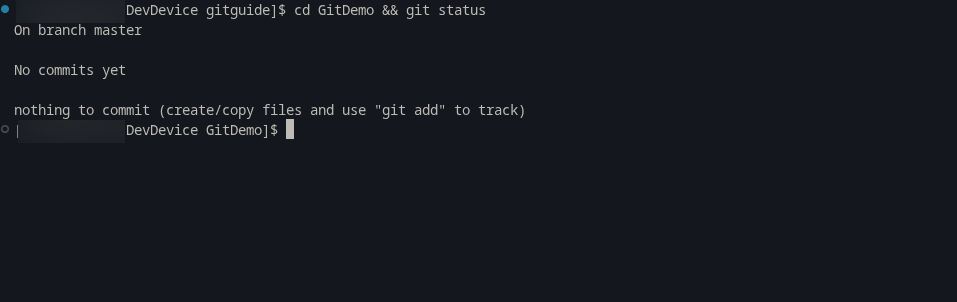
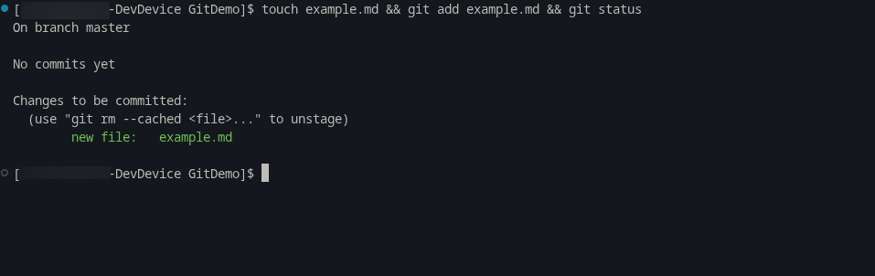
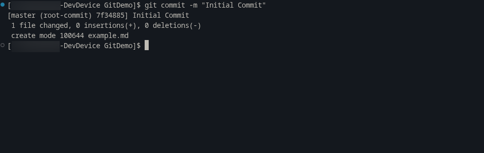

# Git/VCS Research and Consilidation

## What is VCS
- VCS stands for Version Control System
- Version control, also known as “source control”, is a way of tracking, managing, and safeguarding changes to digital assets over time, so teams can collaborate efficiently without losing work or overwriting changes.

## What is GIT
- Git is a free and open source distributed version control system designed to handle everything from small to very large projects with speed and efficiency.

### How does it work
- First time you make a version in git it will store that version of the file
- Every new version it will track the changes between the recent and current
	- Compares the two, if there are changes it will save the changes instead of saving everything by storing a reference to the unedited files.
	- Stores as binary type objects (blobs). 
	- Version is called a "commit" aka a contained package version.
		 - Like a snapshots
- The Three states:
	- Working dir
		- What is currently on the device
	- Staging
	- .gitdir (commited)

## What are the main git commands to know
- `git init [repositoryName]`
- `git status`
- `git add [fileName]`
- `git commit -m ""`

-----

## Demo/Guide for using Git Locally

### Core Git Workflow

#### Using Bash:

##### Start:
```shell
cd Documents
mkdir GitDemo && cd GitDemo
git init GitTest
cd GitTest && git status
```

Output:
```shell
git init GitDemo
hint: Using 'master' as the name for the initial branch. This default branch name
hint: will change to "main" in Git 3.0. To configure the initial branch name
hint: to use in all of your new repositories, which will suppress this warning,
hint: call:
hint:
hint:   git config --global init.defaultBranch <name>
hint:
hint: Names commonly chosen instead of 'master' are 'main', 'trunk' and
hint: 'development'. The just-created branch can be renamed via this command:
hint:
hint:   git branch -m <name>
hint:
hint: Disable this message with "git config set advice.defaultBranchName false"

cd gitDemo && git status
On branch master

No commits yet

Changes to be committed:
  (use "git rm --cached <file>..." to unstage)
        new file:   gitguides
```

##### Adding to git:
(Inside of GitTest)
```shell
touch test.txt
ls
git add test.txt
```

##### Commiting to git:
(Inside of GitTest):
```shell
git commit -m "Initial Commit"
```

Output:
```shell
git commit -m "Initial Commit"
[master (root-commit) c01b349] Initial Commit
 1 file changed, 13 insertions(+)
 create mode 100644 gitguides
```

##### Screenshots:



